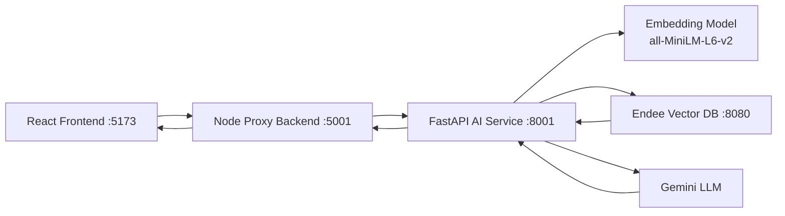

# NutriSense RAG with Endee Vector Database

NutriSense is a full-stack AI/ML recipe recommendation system that uses Retrieval-Augmented Generation (RAG) for personalized meal guidance.

## Project Overview
The project helps users get recipe recommendations and adaptations based on:
- recipe intent (for example: "Butter Chicken")
- dietary preferences
- health focus
- allergen exclusions
- nutrition targets (calories, protein, fat)

## Problem Statement
Traditional recipe search is keyword-only and does not adapt to user health constraints. This project solves that by combining:
- semantic retrieval from a vector database (Endee)
- metadata filtering (diet/allergens/health)
- LLM-based adaptation and explanation (Gemini)

## Mandatory Endee Repository Compliance (Completed)
To satisfy evaluation requirements, these mandatory steps were completed before integration:
- Starred official Endee repo: [https://github.com/endee-io/endee](https://github.com/endee-io/endee)
- Forked Endee repo: [https://github.com/text-ashish/endee](https://github.com/text-ashish/endee)
- Used fork as the working Endee base locally: `/Users/ashish/Nervesparks/endee`
- Added upstream remote to official repo for sync workflow

## System Design


## Technical Approach
1. Recipe dataset is preprocessed into rich text chunks and normalized nutrition metadata.
2. Chunks are embedded using `sentence-transformers`.
3. Embeddings and metadata are indexed into Endee.
4. On query:
- embed user query
- search nearest vectors in Endee
- apply metadata filters locally (diet, allergens, health)
- pass retrieved context to Gemini for final personalized response

## How Endee Is Used
The AI service supports `VECTOR_DB_BACKEND=endee` and uses Endee HTTP APIs:
- index management: create/list/delete
- vector insert: batch insert of embedding + metadata payload
- search: top-k nearest vectors via `/api/v1/index/{index}/search`

Key env vars:
```bash
VECTOR_DB_BACKEND=endee
ENDEE_URL=http://localhost:8080
ENDEE_INDEX_NAME=recipes
ENDEE_SPACE_TYPE=cosine
ENDEE_PRECISION=int16
ENDEE_REBUILD_INDEX=true
# optional if auth enabled
ENDEE_AUTH_TOKEN=
```

## Repository Structure
- `frontend/` React UI (Vite)
- `backend/` Node.js API proxy
- `ai_service/` FastAPI RAG service (Endee + Gemini integration)
- `ai_service/data/` recipes and precomputed artifacts
- `ai_service/src/` preprocessing, embeddings, vectorstore, RAG logic

## Setup and Execution

### 1. Prerequisites
- Python 3.10+
- Node.js 18+
- Git
- Endee server (local or remote)
- Gemini API key

### 2. Clone this repository
```bash
git clone https://github.com/text-ashish/nervesparks-endee-rag.git
cd Nervesparks
```

### 3. Start Endee
Use your forked Endee checkout (`/Users/ashish/Nervesparks/endee`):

Option A: Docker (if Docker installed)
```bash
cd /Users/ashish/Nervesparks/endee
docker compose up -d
```

Option B: Native binary (no Docker)
```bash
cd /Users/ashish/Nervesparks/endee
NDD_DATA_DIR=/Users/ashish/Nervesparks/endee/data ./build/ndd-neon-darwin
```

Option C: Remote Endee
- set `ENDEE_URL` to your remote endpoint instead of localhost

### 4. Configure and run AI service
```bash
cd /Users/ashish/Nervesparks/ai_service
python3 -m venv .venv
source .venv/bin/activate
pip install -r requirements.txt
```

Create `/Users/ashish/Nervesparks/ai_service/.env`:
```bash
GEMINI_API_KEY=your_key
GEMINI_MODEL=gemini-2.5-flash
VECTOR_DB_BACKEND=endee
ENDEE_URL=http://localhost:8080
ENDEE_INDEX_NAME=recipes
ENDEE_SPACE_TYPE=cosine
ENDEE_PRECISION=int16
ENDEE_REBUILD_INDEX=true
```

Run AI service:
```bash
cd /Users/ashish/Nervesparks/ai_service
./.venv/bin/python app.py
```

### 5. Run Node backend
```bash
cd /Users/ashish/Nervesparks/backend
npm install
npm start
```

### 6. Run frontend
```bash
cd /Users/ashish/Nervesparks/frontend
npm install
npm run dev
```

Open UI at `http://localhost:5173`.

## Verification
Health checks:
```bash
curl http://localhost:8080/api/v1/health
curl http://localhost:8001/
```

Sample recommendation call:
```bash
curl -X POST http://localhost:8001/get_recipe \
  -H 'Content-Type: application/json' \
  -d '{"query":"Butter Chicken","dietary":"None","health":"Heart-Friendly","allergens":"","calories":0,"protein":0,"fat":0}'
```

## Notes
- If dataset has empty `health_tags`, strict health filtering can over-prune results. Current implementation avoids hard blocking when tags are empty.
- Set `ENDEE_REBUILD_INDEX=false` after first successful indexing if you want faster restarts without reindex.

## License
This project uses the license of this repository. Endee usage follows the upstream Endee license.
