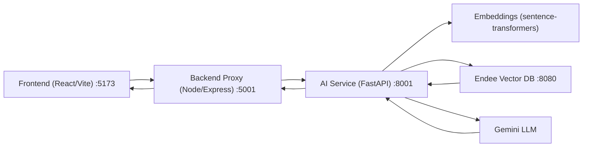

# NutriSense: Endee-Powered RAG for Personalized Recipe Recommendation

NutriSense is a full-stack AI/ML project that delivers personalized recipe recommendations using a Retrieval-Augmented Generation (RAG) pipeline with Endee as the vector database.

## 1. Project Overview
Users submit:
- recipe query
- dietary preference
- health focus
- allergens to exclude
- nutrition targets (calories, protein, fat)

The system retrieves semantically relevant recipes from Endee, then uses Gemini to generate a personalized adapted recommendation.

## 2. Problem Statement
Traditional recipe search is mostly keyword-based and not personalized for health and dietary constraints. This project solves that by combining:
- semantic vector retrieval
- metadata filtering
- LLM-based adaptation and explanation

## 3. Mandatory Endee Repository Compliance (Completed)
Required evaluation steps were completed:
- Starred official Endee repository: [https://github.com/endee-io/endee](https://github.com/endee-io/endee)
- Forked Endee repository: [https://github.com/text-ashish/endee](https://github.com/text-ashish/endee)
- Used the forked Endee repository as the working base
- Added official upstream remote for sync workflow

## 4. System Design


## 5. Technical Approach
1. Preprocess recipes into chunks with structured metadata.
2. Generate embeddings for chunks.
3. Index embeddings + metadata into Endee.
4. On query:
- embed user query
- retrieve top-k candidates from Endee
- apply local filters (diet/allergens/health)
- generate final personalized output with Gemini

## 6. How Endee Is Used
Endee is the retrieval backend (`VECTOR_DB_BACKEND=endee`).

Used APIs:
- index lifecycle (`create`, `list`, `delete`)
- vector insert (batched embeddings + metadata)
- vector search (`/api/v1/index/{index}/search`)

Core config:
```bash
VECTOR_DB_BACKEND=endee
ENDEE_URL=http://localhost:8080
ENDEE_INDEX_NAME=recipes
ENDEE_SPACE_TYPE=cosine
ENDEE_PRECISION=int16
ENDEE_REBUILD_INDEX=true
# Optional if Endee auth enabled:
# ENDEE_AUTH_TOKEN=your_token
```

## 7. Repository Structure
- `frontend/` React web app
- `backend/` Node.js proxy API
- `ai_service/` FastAPI RAG service
- `ai_service/src/` preprocess, embeddings, vectorstore, rag logic
- `ai_service/data/` dataset + artifacts

## 8. Setup and Execution

### 8.1 Prerequisites
- macOS/Linux terminal
- Git
- Docker Desktop with Docker Compose
- Python 3.10+
- Node.js 18+
- Gemini API key
- Local Endee fork checkout

### 8.2 Clone this repository
```bash
git clone https://github.com/text-ashish/nutrisense-endee-rag.git
cd nutrisense-endee-rag
```

### 8.3 Start Endee (Docker Compose)
In your Endee fork directory:
```bash
docker compose up -d
```

Health check:
```bash
curl http://localhost:8080/api/v1/health
```

If `endee-oss:latest` is missing, build once and rerun:
```bash
docker build -f infra/Dockerfile --build-arg BUILD_ARCH=neon -t endee-oss:latest .
docker compose up -d
```

### 8.4 Configure and run AI service
```bash
cd ai_service
python3 -m venv .venv
source .venv/bin/activate
pip install -r requirements.txt
```

Create `ai_service/.env`:
```bash
GEMINI_API_KEY=your_key
GEMINI_MODEL=gemini-2.5-flash
VECTOR_DB_BACKEND=endee
ENDEE_URL=http://localhost:8080
ENDEE_INDEX_NAME=recipes
ENDEE_SPACE_TYPE=cosine
ENDEE_PRECISION=int16
ENDEE_REBUILD_INDEX=true
```

Run AI service:
```bash
./.venv/bin/python app.py
```

### 8.5 Run backend proxy
```bash
cd ../backend
npm install
npm start
```

### 8.6 Run frontend
```bash
cd ../frontend
npm install
npm run dev
```

Open UI:
- `http://localhost:5173`

## 9. Validation
```bash
curl http://localhost:8080/api/v1/health
curl http://localhost:8001/
```

Sample request:
```bash
curl -X POST http://localhost:8001/get_recipe \
  -H 'Content-Type: application/json' \
  -d '{"query":"Butter Chicken","dietary":"None","health":"Heart-Friendly","allergens":"","calories":0,"protein":0,"fat":0}'
```

## 10. Notes
- Endee must be reachable at `ENDEE_URL`.
- After first successful indexing, you can set `ENDEE_REBUILD_INDEX=false` for faster restarts.

## 11. License
- Project follows this repository license.
- Endee usage follows upstream Endee license.
